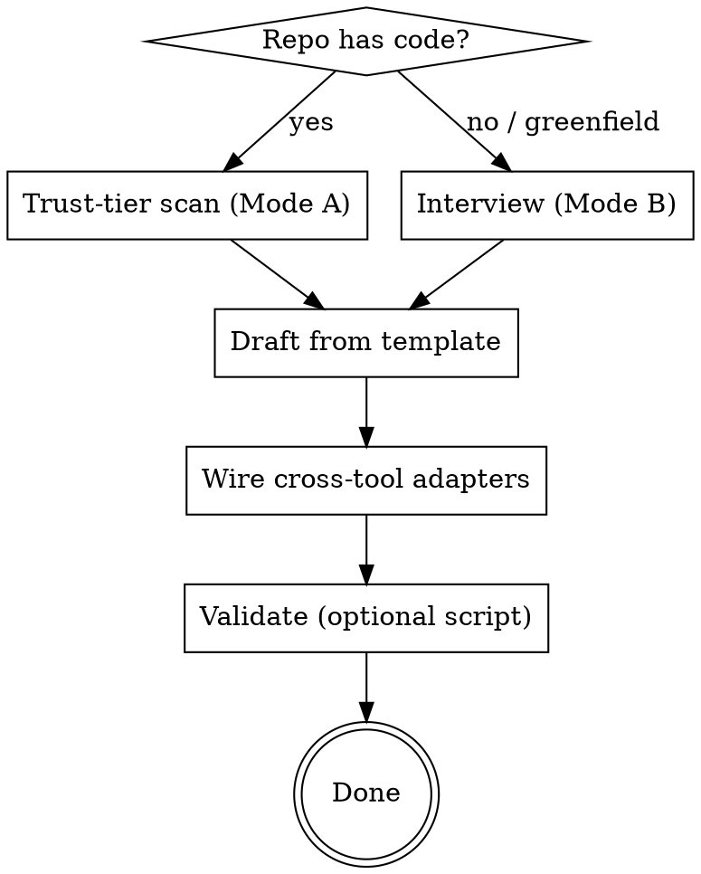

# Writing AGENTS.md

## Overview

`AGENTS.md` is the cross-tool "README for agents": a predictable, plain-Markdown file at a repo's
root holding the build commands, conventions, constraints, and verification rules a coding agent
needs. It is read automatically by Codex, Cursor, Copilot, Gemini CLI, Aider, and others; Claude
Code reads `CLAUDE.md` and can import `AGENTS.md`.

**Core principle: an AGENTS.md is a behavioral contract, not documentation. Every line must change
what the agent *does*. If a line doesn't change behavior, delete it.**

The failure mode is never "too few sections." It's bloat, vague rules, duplicated README prose, and
**guessed commands that don't exist**. A tight, accurate 120-line file beats a 400-line one.

## When to use

- Creating an AGENTS.md for a new project, or generating one from an existing repo.
- Improving/auditing an existing AGENTS.md or CLAUDE.md.
- Migrating from `CLAUDE.md` / `.cursorrules` / `copilot-instructions.md` to a shared AGENTS.md.

Not for: per-task notes (those go in the issue/PR/chat, never in AGENTS.md) or content the README
already covers (link to it instead).

## Workflow



### Mode A — generate from an existing repo (trust-tier scan)

Read signals in trust order; never let lower trust override higher. **Full table in `reference.md`.**

| Tier | Sources | Use for |
|------|---------|---------|
| High | lockfiles & manifests, Makefile/justfile, CI workflows, lint/format/type configs, SECURITY.md | exact commands, gates, protected paths |
| Medium | README, CONTRIBUTING, devcontainer | repo purpose, layout, local setup |
| Low | issues, PRs, code comments | *hints only* — corroborate before writing |
| Excluded | `.env*`, secrets, keys | **redact — never quote into output** |

Detect and record: package manager + **exact** commands (install/dev/build/lint/typecheck/test);
the repo map and high-risk paths (auth, billing, migrations, infra, secrets, generated code);
conventions from lint/format/type configs; CI gates. Merge any existing `CLAUDE.md`, `.cursorrules`,
`.github/copilot-instructions.md`.

**IRON RULE: write only commands and paths you verified exist. Never guess a command.** If a command
is uncertain, mark it `# UNVERIFIED — confirm` rather than inventing certainty.

### Mode B — greenfield interview

Ask, one at a time: language/stack · package manager · how to run/build/test · conventions to
enforce · hard "do not" constraints · what "done" means · deploy target. Then pick the matching
`templates/` archetype.

### Draft

Use a `templates/` archetype and keep the value order (commands first). Apply these principles —
this is the part most files get wrong:

1. **Right altitude.** Specific enough to guide, flexible enough not to be brittle. Not vague fluff,
   not hardcoded edge-case logic.
2. **Minimal high-signal tokens.** Target ≤ ~150 lines. Every token spent lowers adherence to the
   rest ("context rot").
3. **Exact, runnable commands.** `pnpm test`, never "run the tests."
4. **Negative rules carry weight.** "Never commit `.env`", "no class components" — state them.
5. **Hard-gate vs discipline.** Separate blocking checks (must pass before done) from softer style
   guidance. Make the definition of done explicit.
6. **Emphasis sparingly.** `IMPORTANT`/`YOU MUST` on ~10–15 load-bearing rules only; if everything
   is important, nothing is.
7. **Examples over prose.** One concrete example beats a paragraph (see `EXAMPLE.md`).
8. **Don't duplicate the README.** Link to it.
9. **Stable rules only.** No session notes, no per-task logs, no changelog chatter in the file.

Section catalog and per-section guidance: `reference.md`. Optional machine-readable frontmatter:
`frontmatter-schema.md` (default OFF — clean prose is the default).

### Wire cross-tool adapters

Keep `AGENTS.md` canonical; make every other tool point at it (never copy-paste — copies drift):

- **Claude Code** — create `CLAUDE.md` that imports it (Anthropic-official), optionally with
  Claude-only notes below:
  ```md
  @AGENTS.md
  ```
  Or, if you need zero additions: `ln -s AGENTS.md CLAUDE.md`.
- **Copilot (optional)** — `.github/copilot-instructions.md` for chat/review parity.

Adapter matrix and monorepo/nested guidance: `reference.md`.

### Validate (optional)

```bash
python scripts/validate_agents_md.py AGENTS.md --repo . --fail-on secret_leak,invalid_commands
```
Checks line/byte budget, required sections, secret leaks, and (with `--repo`) that paths and commands
actually exist. It's a convenience, not a gate — the agent should already have verified these.

### Maintain

Update only after a mistake **repeats** — ask the agent for a one-line retrospective and add a rule.
For rules that must always hold, **back them with enforcement** (lint/CI/hooks): prose guidance gets
~25–40% compliance; an enforced check gets ~95%.

## Common mistakes

| Mistake | Fix |
|---------|-----|
| Guessed/stale commands | Verify against manifests/CI; mark unverified ones |
| Bloat / >200 lines | Cut to high-signal rules; shard or use reference files |
| Duplicating the README | Link instead |
| Vague rules ("write clean code") | Replace with a concrete, checkable rule |
| Everything marked IMPORTANT | Reserve emphasis for ~10–15 load-bearing rules |
| No definition of done | Add explicit hard-gate verification commands |
| Secrets quoted from `.env` | Redact; reference the variable name only |
| Session notes / task logs in the file | Keep those in the issue/PR/chat |
| Copy-pasted CLAUDE.md / .cursorrules | Make them point at AGENTS.md |
